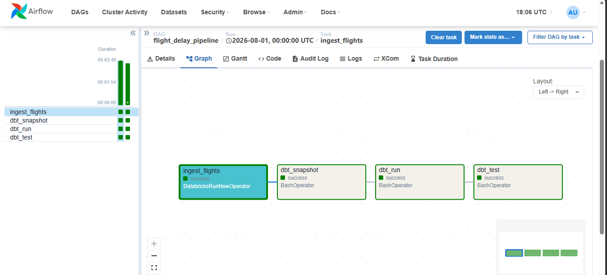
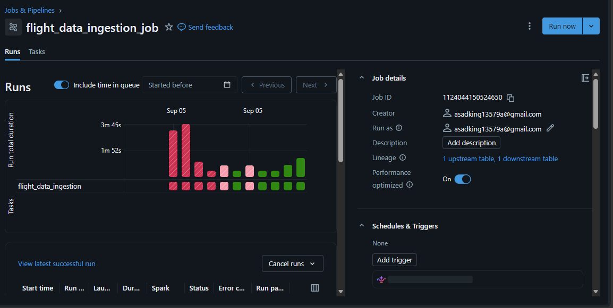
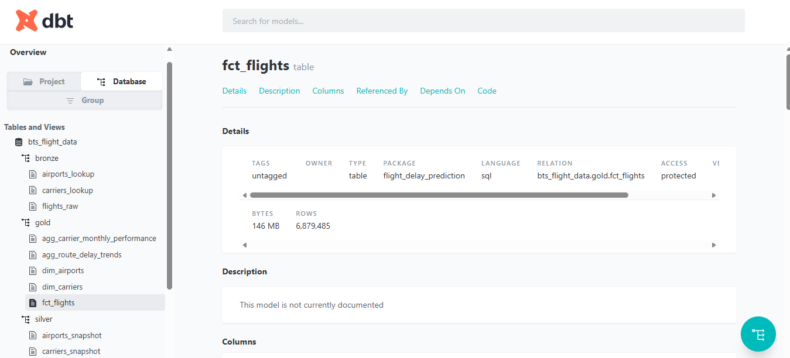
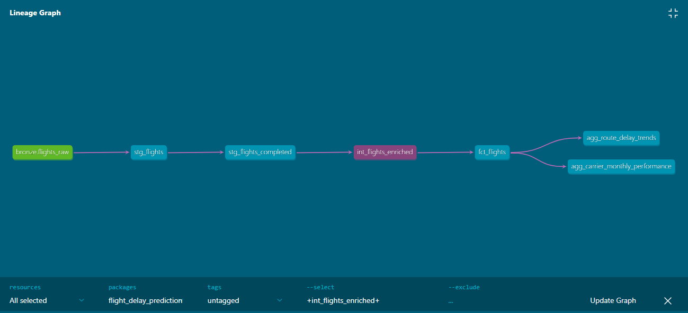
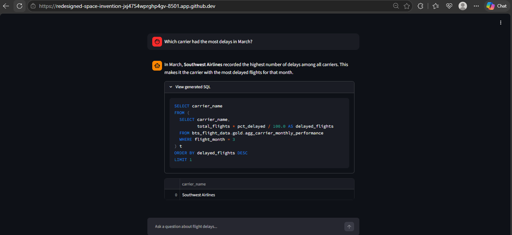

# Flight Delay Prediction Pipeline

A production-style data engineering project: BTS flight data ingested into Databricks, transformed through a medallion architecture with dbt, orchestrated with Airflow, and exposed through a natural-language AI agent for querying the warehouse — all containerized with Docker.

---

## Overview

**Dataset:** BTS On-Time Performance data (2025 onward, ~10.5M+ flight records) + OpenFlights airport/airline reference data.

**Goal:** Build a genuinely production-minded pipeline — not just a one-off notebook — covering ingestion, dimensional modeling, orchestration, testing, and a natural-language interface to the warehouse.

**Why this dataset:** chosen specifically to avoid the common Kaggle/tutorial datasets (NYC taxi, Walmart, Netflix). BTS flight data is large, requires genuine transformation work (heavy SQL, window functions, dimensional modeling), and supports a real, explainable use case.

---

## Tech Stack

| Layer | Tool |
|---|---|
| Storage & Compute | Databricks Free Edition (Unity Catalog, Delta Lake, SQL Warehouse) |
| Transformation | dbt-databricks |
| Orchestration | Apache Airflow (Dockerized) |
| Containerization | Docker / Docker Compose |
| AI Agent | FastAPI + Groq (LLM) + Databricks SQL Connector |
| Frontend | Streamlit |
| Dependency management | uv |
| Version control | Git / GitHub |

---

## Architecture

```
BTS PREZIP + OpenFlights (source)
        │
        ▼
Databricks Volume (zipped/ + unzipped/)
        │
        ▼
BRONZE (Delta tables, self-determining incremental load)
   flights_raw, airports_lookup, carriers_lookup
        │
        ▼ dbt
SILVER (staging + snapshots + intermediate)
   stg_flights, stg_flights_completed, stg_flights_cancelled_diverted,
   stg_airports, stg_carriers, airports_snapshot, carriers_snapshot,
   int_flights_enriched
        │
        ▼ dbt
GOLD (marts — star schema + aggregates)
   dim_airports, dim_carriers, fct_flights,
   agg_carrier_monthly_performance, agg_route_delay_trends,
   ml_training_features
        │
        ├──────────────────────────────┐
        ▼                              ▼
  AI Agent (FastAPI)              Analytics / BI
  text → SQL → Databricks              (dbt docs, dashboards)
        │
        ▼
  Streamlit Chat UI

Orchestration: Airflow (Dockerized) triggers Databricks Jobs +
               runs dbt snapshot/run/test, on a monthly schedule
```

---

## Why the project is built this way

### Medallion architecture (Bronze → Silver → Gold)
Raw BTS data has ~110 columns, inconsistent types, and no reference-data joins. Bronze preserves raw fidelity; Silver cleans and validates; Gold shapes data for direct business/ML/agent consumption. Each layer has a distinct, defensible job.

### dbt over raw SQL scripts
dbt adds testing, documentation, lineage, and version control discipline to SQL transformations — the difference between "a query that works" and "a transformation you can trust in production."

### Star schema (fact/dimension) instead of one flat table
`fct_flights` stores surrogate keys, not repeated airport/carrier text — avoiding duplication at scale and keeping a single source of truth per dimension. A separate `ml_training_features` flat mart exists on top of this star schema purely for the model/agent's convenience, without compromising the canonical model.

### SCD2 snapshots for dimensions
Airport/carrier reference data is snapshotted with `dbt snapshot`, giving every dimension row a valid time range (`valid_from`/`valid_to`) rather than only ever reflecting "now." **Honest scoping note:** since this project loaded a single historical bulk year rather than running incrementally from day one, `fct_flights` joins to the *current* dimension version rather than a strict point-in-time match — the point-in-time join logic is fully built and would activate correctly once the pipeline runs repeatedly over time in production.

### Self-determining incremental ingestion
The flight ingestion notebook checks what months are already loaded in Bronze, downloads only what's missing (treating a 404 as "not yet published by BTS"), and appends rather than overwrites. This means the exact same notebook handles both the first historical bulk load and every subsequent monthly run — no separate "backfill mode" needed.

### Reference data ingestion kept manual/one-time
Airport/carrier lookup data doesn't share the flight data's monthly cadence, so it's deliberately excluded from the automated DAG — loaded once, manually, as a setup step rather than unnecessary repeated work.

### Text-to-SQL AI agent instead of a trained ML model
The project pivoted from training a delay-prediction model to a Groq-powered natural-language agent that generates and executes SQL against the Gold layer live. This avoids needing to retrain/redeploy a model — the agent automatically reflects fresh data on its very next query once a pipeline run completes.

### Airflow orchestration
A single DAG chains `ingest_flights → dbt_snapshot → dbt_run → dbt_test`, triggering the existing Databricks notebook (registered as a Job) rather than duplicating ingestion logic inside Airflow itself. Retries and a failure-alert callback are configured at the DAG level; `dbt test` failing (error-severity only — warnings don't block) automatically fails the pipeline run.

---

## Repository Structure

```
flight-delay-pipeline/
├── databricks_ingestion/
│   ├── flight_data_ingestion       (self-determining incremental notebook)
│   └── lookup_data_ingestion       (one-time/manual reference data load)
├── dbt-project/
│   ├── models/
│   │   ├── staging/
│   │   ├── intermediate/
│   │   └── marts/
│   ├── snapshots/
│   ├── tests/
│   └── dbt_project.yml
├── airflow/
│   ├── dags/flight_pipeline_dag.py
│   ├── Dockerfile
│   ├── requirements-airflow.txt
│   └── requirements-dbt.txt
├── api/
│   ├── main.py
│   ├── sql_agent.py
│   ├── Dockerfile
│   └── requirements.txt
├── streamlit_app/
│   └── app.py
├── docker-compose.yml
├── .env.example
├── .gitignore
└── imgs/
    ├── airflow-dag-graph.png
    ├── databricks-job-runs.png
    ├── dbt_docs.png
    ├── dbt_lineage_graph.png
    └── streamlit_app.png
```

---

## One-Time Setup (before running anything)

1. Databricks Free Edition workspace, Unity Catalog with `bronze`/`silver`/`gold` schemas, and a Volume for raw file storage.
2. Run `lookup_data_ingestion` once, manually, to populate `airports_lookup`/`carriers_lookup` (reference data — not part of the automated DAG).
3. Register `flight_data_ingestion` as a Databricks Job; note its Job ID.
4. In Airflow: add a `databricks_default` connection (host + token) and an `ingest_flights_job_id` Variable.
5. Populate `.env` (see `.env.example`) with `DATABRICKS_HOST`, `DATABRICKS_HTTP_PATH`, `DATABRICKS_TOKEN`, `GROQ_API_KEY`.

## Running the Pipeline

```bash
docker compose build --no-cache
docker compose up airflow-init
docker compose up -d
```

- Airflow UI: `http://localhost:8080` (`admin`/`admin`)
- FastAPI: `http://localhost:8000/health`
- Streamlit: run separately with `uv run streamlit run streamlit_app/app.py`

Unpause and trigger the DAG:
```bash
docker compose exec airflow-scheduler airflow dags unpause flight_delay_pipeline
docker compose exec airflow-scheduler airflow dags trigger flight_delay_pipeline
```

---

## Results

### Airflow DAG — full successful run
`ingest_flights → dbt_snapshot → dbt_run → dbt_test`, each stage succeeding in sequence, triggered end-to-end through Airflow rather than run manually.



### Databricks Job Runs — the ingestion notebook triggered by Airflow
Shows the `flight_data_ingestion` job's run history, including the debugging attempts before the fix and the clean successful runs after.



### dbt Docs — generated documentation
Full catalog of Bronze, Silver, and Gold tables, including `fct_flights` (6.9M+ rows, 146MB).



### dbt Lineage Graph
The complete transformation path from raw Bronze source through staging, intermediate enrichment, to the fact table and downstream aggregate marts.



### AI Agent — Streamlit chat interface
A natural-language question translated into generated SQL, executed live against the Gold layer, with results returned conversationally.



---

## Known Limitations / Honest Trade-offs

- **SCD2 point-in-time joins**: fully implemented, but `fct_flights` currently joins to the *current* dimension version rather than a strict historical match, since this project's one-time bulk load predates the snapshot's capture timestamp. This is a documented, deliberate scoping decision — the mechanism is correct and would activate properly under continuous production operation.
- **~0.04% of flights have no matching airport dimension** (e.g., `XWA`, `EAR` — small regional airports not present in the OpenFlights reference dataset). Surfaced as a `warn`-severity dbt test rather than a hard failure, since it's a known, small, explainable gap in a third-party reference dataset.
- **No trained ML model** — the project intentionally uses a live text-to-SQL agent instead of a trained/retrained model, trading a retraining step for always-current answers.
- **Local/dev orchestration** — Airflow runs with `LocalExecutor` via Docker Compose, appropriate for this project's scale. Production at larger scale would move to `CeleryExecutor`/`KubernetesExecutor` and managed infrastructure (MWAA, Cloud Composer, or a Kubernetes cluster).