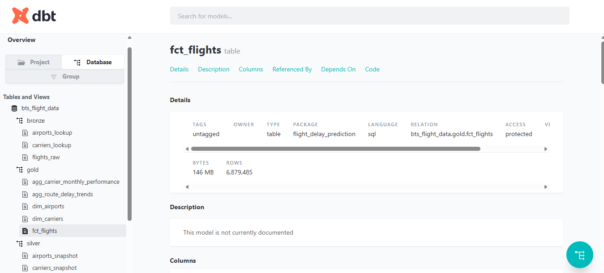
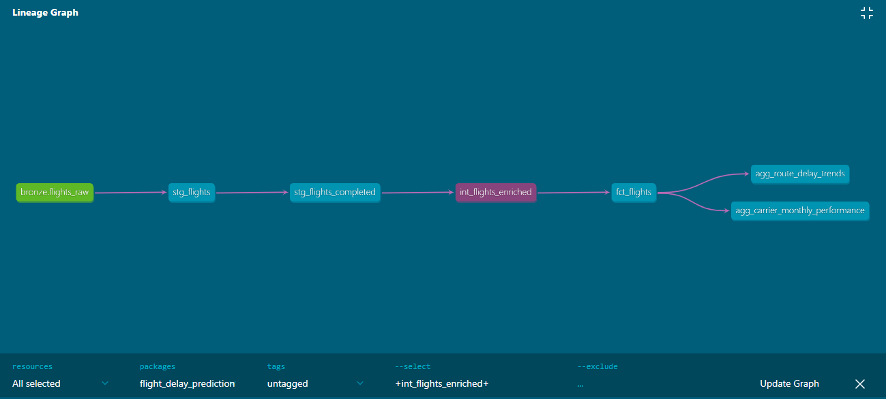

# Flight Delay Prediction — dbt Transformation Layer

This README documents the dbt project that powers the transformation layer of the Flight Delay Prediction pipeline: raw BTS flight data and OpenFlights reference data, transformed through a medallion architecture (Bronze → Silver → Gold) into a business-ready star schema, feeding an eventual ML model.

---

## 1. Overview

**Source data:** BTS On-Time Performance data (12 months of 2025, ~7 million flight records) + OpenFlights airport and airline reference data.

**Goal:** transform raw flight records into a clean, tested, dimensionally-modeled warehouse that supports both analytics (carrier/route performance dashboards) and machine learning (flight delay prediction).

**Stack:** Databricks (Unity Catalog, Delta Lake, SQL Warehouse) + dbt-databricks + uv (Python/dependency management).

---

## 2. Architecture

```
BRONZE (outside dbt — loaded via PySpark)
    flights_raw            ← BTS raw CSV data, ~7M rows, ~110 columns
    airports_lookup        ← OpenFlights airport reference data
    carriers_lookup        ← OpenFlights airline reference data

SILVER (dbt: staging/)
    stg_flights                        ← cleaned, typed, ~27 relevant columns
    stg_flights_completed              ← non-cancelled, non-diverted flights only
    stg_flights_cancelled_diverted     ← cancelled/diverted flights, kept separately
    stg_airports                       ← cleaned airport reference data
    stg_carriers                       ← cleaned, deduplicated airline reference data

SILVER (dbt: snapshots/)
    airports_snapshot      ← SCD2 history tracking for airports
    carriers_snapshot      ← SCD2 history tracking for carriers

SILVER (dbt: intermediate/)
    int_flights_enriched   ← window-function features: cascading delay, congestion,
                              carrier/route historical performance, target column

GOLD (dbt: marts/)
    dim_airports            ← airport dimension, surrogate keys, SCD2
    dim_carriers             ← carrier dimension, surrogate keys, SCD2
    fct_flights               ← fact table, one row per flight, FK to dimensions
    agg_carrier_monthly_performance  ← carrier performance summary
    agg_route_delay_trends            ← route performance summary
    ml_training_features               ← flat, joined table for the ML training script
```

---

## 3. Why this project is structured this way

### Why medallion architecture (Bronze/Silver/Gold)?
Raw BTS data is messy: ~110 columns (most irrelevant to delay prediction), inconsistent types (`Cancelled`/`Diverted` stored as `double` rather than boolean), and no reference-data joins. Doing all cleaning, feature engineering, and business logic in one giant query would be unmaintainable and untestable. Medallion architecture separates concerns:
- **Bronze** preserves raw fidelity — an unaltered archive of what was ingested.
- **Silver** is where data becomes *trustworthy* — typed, cleaned, validated, still at the same grain as the source.
- **Gold** is where data becomes *business-ready* — joined, dimensionally modeled, aggregated for direct consumption.

### Why dbt specifically?
Raw SQL transformations in notebooks have no built-in testing, versioning discipline, documentation, or lineage tracking. dbt turns SQL into modular, tested, documented, version-controlled models — critical for a "production-standard" pipeline rather than a one-off script.

### Why a proper fact/dimension (star schema) model instead of one big flat table?
A single denormalized table would duplicate airport/carrier text (name, city, country) across millions of flight rows — wasteful at this scale, and it breaks single-source-of-truth (correcting an airport's name would require reprocessing the entire fact table). Instead:
- **Dimensions** (`dim_airports`, `dim_carriers`) store descriptive attributes once, each with a **surrogate key**.
- The **fact table** (`fct_flights`) stores only foreign keys (surrogate keys) plus the flight's own measures — no duplicated text.
- A separate, clearly-labeled **`ml_training_features`** flat table exists *on top of* the star schema specifically for the ML training script's convenience, without polluting the canonical model.

### Why SCD2 (Slowly Changing Dimension Type 2) via dbt snapshots?
A plain view of the airport/carrier lookup data only ever shows the *current* state — if an airport's name or timezone data ever changed between pipeline runs, a naive join would silently misattribute historical flights to the wrong (updated) version of that dimension. Snapshots preserve every version of a dimension row with a valid date range (`dbt_valid_from`/`dbt_valid_to`), enabling point-in-time-correct joins.

**Honest scoping note:** this project loads a single bulk year of historical data rather than running incrementally over time, so the SCD2 snapshot's capture timestamp (whenever the pipeline was first run) postdates every flight in the dataset. A strict point-in-time join (`fl_date between valid_from and valid_to`) would therefore incorrectly exclude almost all flights. `fct_flights` joins to the **current** dimension version (`is_current = true`) instead — a deliberate, documented scoping decision, not an oversight. The SCD2 infrastructure (surrogate keys, valid date ranges) is fully built and correct, and the point-in-time join logic would become meaningful and correctly activate if this pipeline ran repeatedly over time (e.g., scheduled via Airflow), which is how a production version of this system would operate.

---

## 4. Step-by-step: what was built, and why

### Step 1 — Ingestion (outside dbt)
BTS flight data and OpenFlights reference data were downloaded via scripted requests (not manual browser downloads) directly into a Databricks Unity Catalog Volume, then unzipped and loaded into Bronze Delta tables via PySpark. This lives outside dbt because dbt only transforms data that already exists in the warehouse — it doesn't ingest external files.

### Step 2 — `sources.yml`
Declares the three Bronze tables as dbt sources. This is the *only* place Bronze is referenced directly (`{{ source('bronze', 'flights_raw') }}`) — every model downstream of staging references other dbt models via `{{ ref(...) }}`, never `source()` again. This distinction matters: `source()` marks data dbt doesn't control; `ref()` builds dbt's dependency graph and lineage.

### Step 3 — Staging models (`models/staging/`)
- **`stg_flights`**: selects ~27 relevant columns out of `flights_raw`'s ~110 (dropping all diversion-detail columns, redundant IDs, and denormalized city/state text that belongs in `dim_airports` instead). Casts `Cancelled`/`Diverted` from `double` (0.0/1.0) to real booleans. Filters rows missing a flight date or carrier.
- **`stg_flights_completed`** / **`stg_flights_cancelled_diverted`**: splits flights by status rather than silently dropping cancelled/diverted rows — both remain queryable, just for different purposes.
- **`stg_airports`** / **`stg_carriers`**: clean the OpenFlights reference data, filtering out placeholder nulls (`\N`) and non-airport entity types.
- **`stg_carriers` deduplication**: IATA carrier codes get reused across decades as airlines shut down and codes get reassigned — the OpenFlights dataset reflects this with multiple `airline_id`s sharing the same `iata` code. A `row_number()` window function keeps exactly one row per carrier code (preferring the currently active airline), which was necessary to make the SCD2 snapshot's unique-key MERGE logic work correctly.

### Step 4 — Snapshots (`snapshots/`)
`airports_snapshot` and `carriers_snapshot` use dbt's `strategy='check'` snapshot method, comparing tracked columns on every run and preserving history when they change. See the SCD2 explanation above for why this exists and its current scoping limitation.

### Step 5 — Intermediate model (`models/intermediate/int_flights_enriched.sql`)
Adds row-level engineered features via window functions — still one row per flight, no dimension joins yet:
- **`prev_flight_arr_delay`**: this specific aircraft's previous flight's arrival delay (`lag()` over `tail_number`), capturing cascading delay.
- **`origin_hourly_avg_delay_30d`**: trailing 30-day average departure delay at this origin/hour, a congestion proxy (deliberately excludes the current row to avoid leakage).
- **`origin_hourly_flight_count`**: same-day flight density at this origin/hour.
- **`carrier_90d_avg_delay`** / **`route_90d_avg_delay`**: trailing 90-day historical performance by carrier and by route.
- **`is_weekend`** / **`is_holiday_season`**: calendar/seasonality flags.
- **`arr_delay_15plus`**: the ML target column (FAA/BTS standard definition of "delayed").

**Deliberately excluded feature:** `actual_elapsed_time - crs_elapsed_time` (elapsed time variance) was considered but excluded — `actual_elapsed_time` is only known *after* a flight lands, the same moment `arr_delay` itself is known. Including it would leak future information into the model.

### Step 6 — Marts (`models/marts/`)
- **`dim_airports`** / **`dim_carriers`**: read from the snapshots, generate a surrogate key (`dbt_utils.generate_surrogate_key`) per dimension version, expose `valid_from`/`valid_to`/`is_current`.
- **`fct_flights`**: joins `int_flights_enriched` to the current version of each dimension, storing surrogate keys rather than duplicated descriptive text — the star schema fact table.
- **`agg_carrier_monthly_performance`** / **`agg_route_delay_trends`**: pre-aggregated business marts, joining to dimensions via simple surrogate-key equality (the point-in-time resolution already happened once, in `fct_flights` — downstream consumers don't repeat that logic).
- **`ml_training_features`**: a flat, fully-joined table built specifically for the model training script's convenience, kept separate from the canonical star schema.

### Step 7 — Testing (`models/marts/marts_schema.yml`)
- `not_null`/`unique` on dimension surrogate keys.
- `dbt_utils.accepted_range` rejecting negative `air_time`/`distance`.
- `not_null` on `fct_flights`' origin/dest surrogate keys, set to **`warn`** rather than `error` severity — a small number of BTS airport codes (~0.04% of records, e.g. `XWA`, `EAR`) don't have a match in the OpenFlights reference dataset, likely smaller regional airports not covered by that source. This is a known, documented, small data-quality gap rather than a pipeline defect, so it's surfaced as a warning rather than blocking the pipeline.

---

## 5. Running the project

```bash
cd dbt-project
uv run dbt deps                # install dbt_utils package
uv run dbt snapshot             # capture SCD2 dimension history
uv run dbt run                  # build staging → intermediate → marts
uv run dbt test                 # run all data quality tests
uv run dbt docs generate        # build documentation site
uv run dbt docs serve           # view docs + lineage graph locally
```

---

## 6. Documentation & Lineage

dbt auto-generates a documentation site and dependency lineage graph from the project's models, sources, and tests.

**dbt docs:**


**Full transformation lineage graph (Bronze sources → Silver → Gold):**
